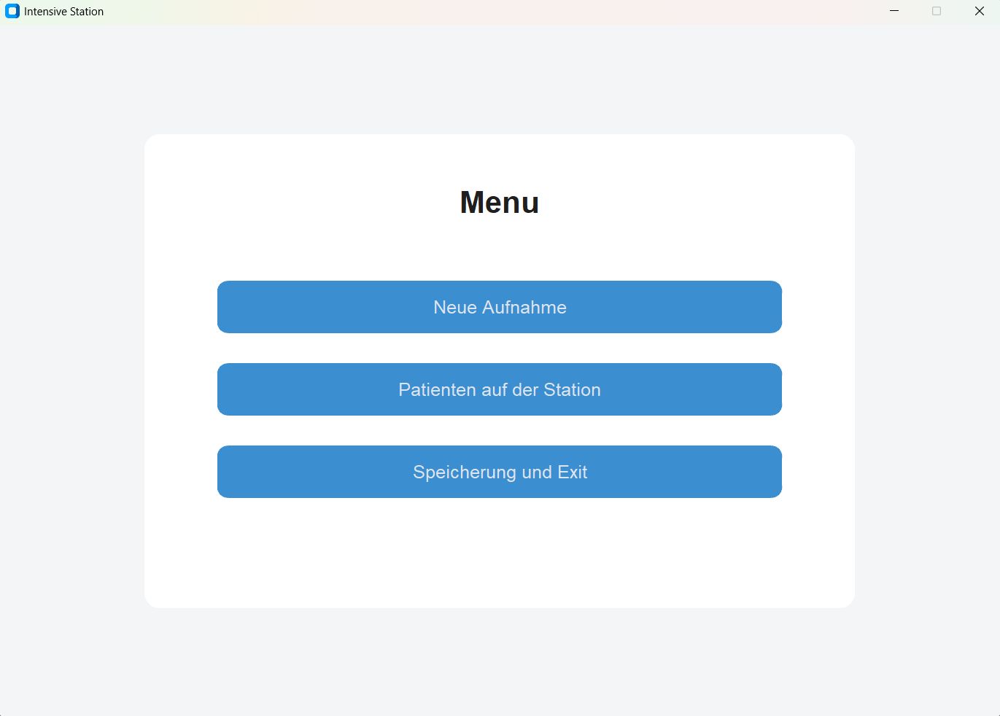
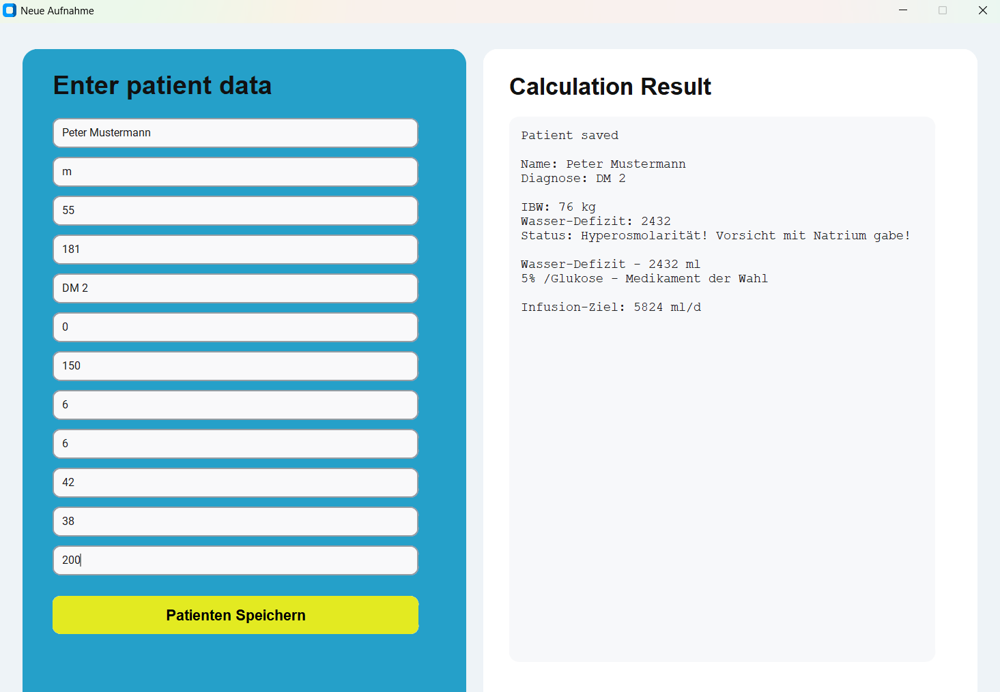
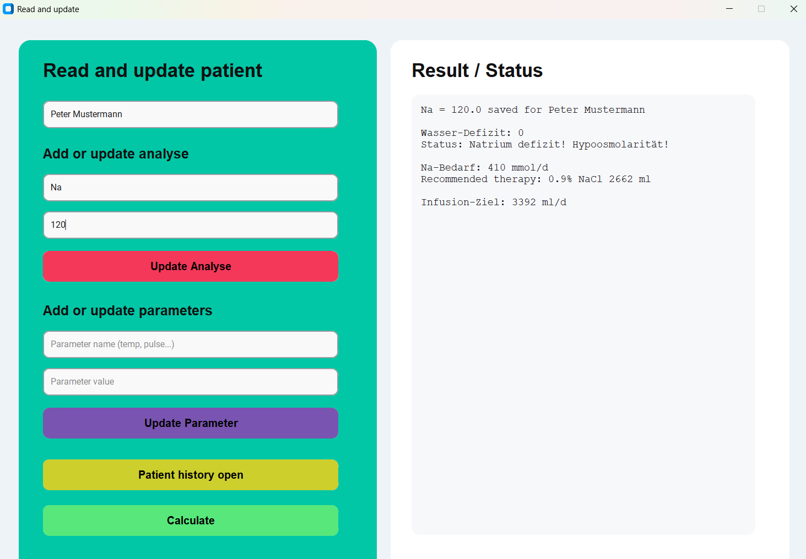
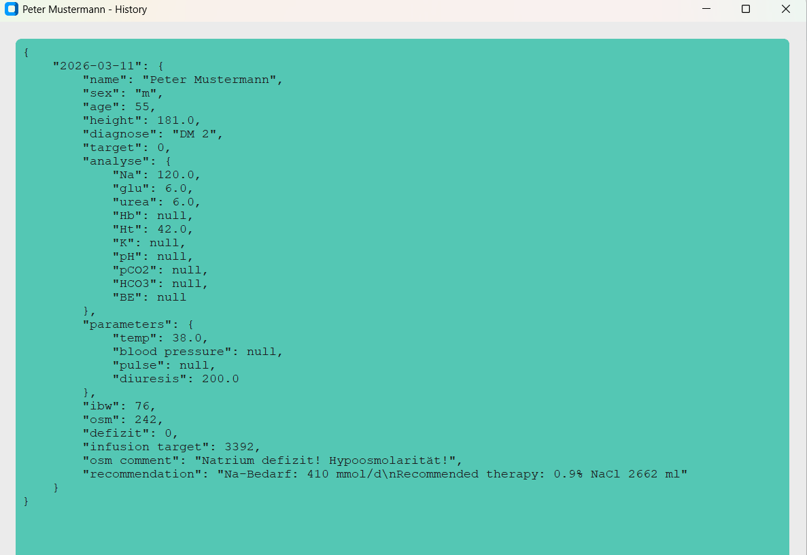

# Intensive Station Calculator

A desktop medical calculator for basic fluid and electrolyte assessment in intensive care patients.

This project was built with **Python** and **CustomTkinter** as a lightweight clinical prototype for structured patient registration, laboratory input, fluid deficit estimation, and infusion planning.

It combines a simple desktop GUI with patient-specific calculations and local JSON-based storage.

---

## Features

- Register a new patient through a graphical interface
- Store patient records locally as JSON files
- Load previously saved patients
- Update laboratory values
- Update clinical parameters
- View patient history
- Recalculate clinical values after updates
- Save daily patient snapshots with date-based history

---

## Clinical calculations included

### Ideal Body Weight (IBW)
- Female: `45.5 + 0.91 × (height - 152.4)`
- Male: `50 + 0.91 × (height - 152.4)`

### Calculated Osmolality
- `2 × Na + glucose / 18 + urea / 2.8`

### Deficit estimation logic
Depending on calculated osmolality, the application estimates:
- **Hypoosmolar state** → sodium deficit logic
- **Normoosmolar state** → water deficit logic based on hematocrit
- **Hyperosmolar state** → free water deficit logic

### Infusion target
The daily infusion target is estimated based on:
- ideal body weight
- perspiration losses
- deficit estimation
- diuresis
- water-balance target

---

## GUI overview

The application includes:

- **Main menu**
  - New patient admission
  - Existing patients on the ward
  - Save and exit

- **New admission window**
  - demographic and diagnostic data entry
  - laboratory and clinical parameter input
  - real-time calculation output with interpretation and therapy suggestion

- **Patient update window**
  - add or update analyses
  - add or update parameters
  - open patient history
  - run calculation for all loaded patients

---

## Project structure

project/

│

├── main.py

├── patient.py

├── storage.py

├── requirements.txt

├── README.md

└── my_patients/

## File description

- main.py — GUI application logic built with CustomTkinter

- patient.py — Patient class and medical calculation methods

- storage.py — loading, saving, and batch calculations

- my_patients/ — local JSON storage for patient files

## How to run
1. Clone the repository
git clone <your-repository-link>
cd <your-repository-folder>
2. Install dependencies
pip install -r requirements.txt
3. Start the application
python main.py

### Data storage

Each patient is stored as an individual JSON file in the my_patients folder.

## Stored data includes:

- demographic information

- diagnosis

- laboratory values

- clinical parameters

- calculated values

- date-based history records

This makes the application simple to run locally without a database.

## Example workflow

- **Open the application**

- **Create a new patient**

- **Enter:**

  - sex

  - age

  - height

  - diagnosis

  - sodium, glucose, urea, hematocrit

  - temperature and diuresis

- **Save the patient**

  - Review or update the patient later

  - Recalculate values after new analysis input

  - Open and review saved history

# Why this project matters

This project combines medical domain knowledge with Python application development.

It was designed as a practical prototype for:

- structured patient documentation

- electrolyte and osmolality interpretation

- basic infusion planning

- reusable local patient storage

It reflects an attempt to translate ICU-style clinical reasoning into a small but functional desktop application.

# Technologies used

- **Python**

- **CustomTkinter**

- **JSON**

- **Pathlib**

- **Object-oriented programming**

# Limitations

This application is intended for educational and portfolio purposes only.

It is not a certified medical device and must not be used as the sole basis for clinical decision-making.

The formulas and logic implemented here represent a simplified prototype and do not replace clinical judgment, institutional protocols, or validated medical software.

# Future improvements

- **stronger field validation**

- **dropdowns instead of free-text entries for some inputs**

- **better error feedback inside the GUI**

- **trends and charts for repeated measurements**

- **search and filtering by diagnosis or date**

- **export to CSV or PDF**

- **ackaging as a standalone desktop app**

- **improved layout and UI styling**

# Screenshots

You can add screenshots here after uploading them to the repository, for example:

---

# Author

Lidiia Petrovska

Medical logic + Python desktop application project
